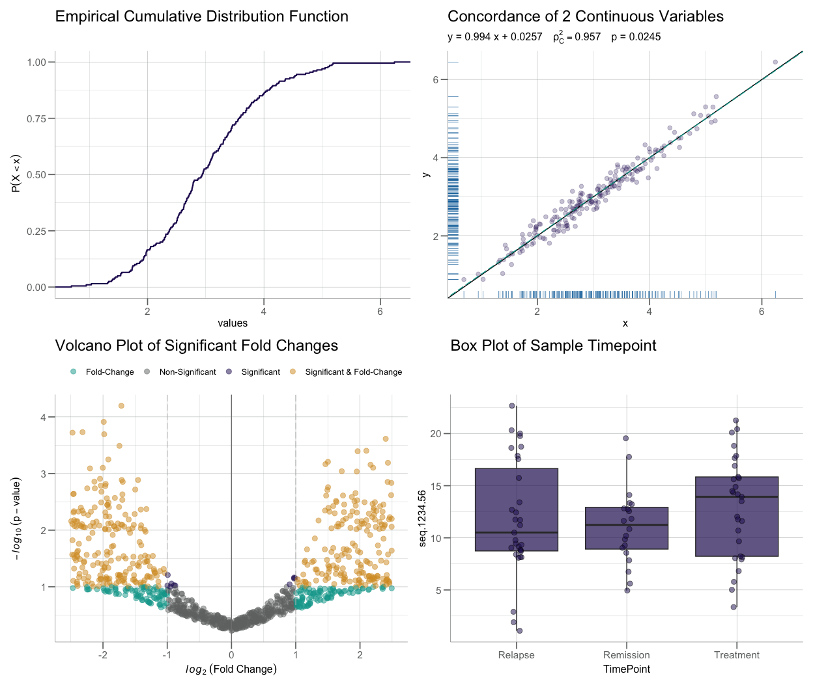
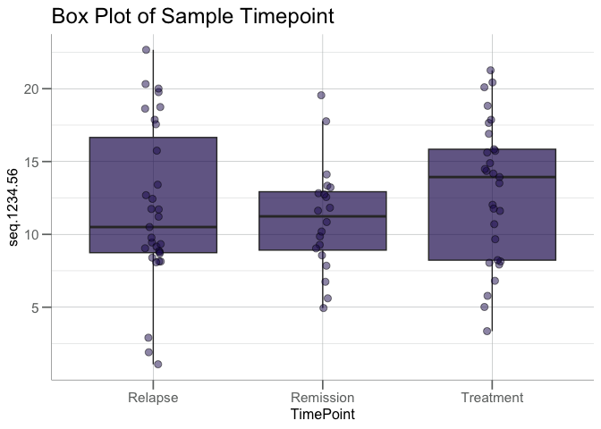
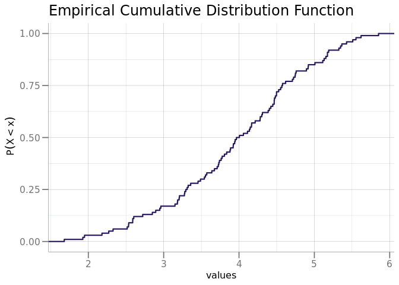
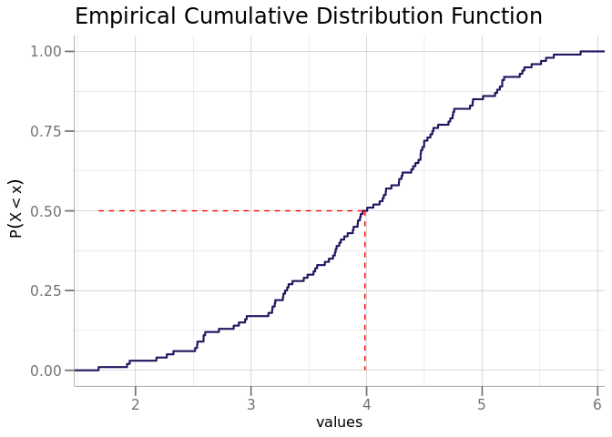
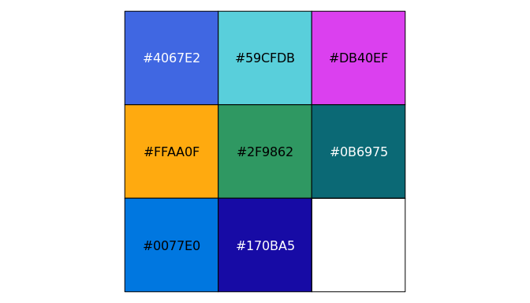
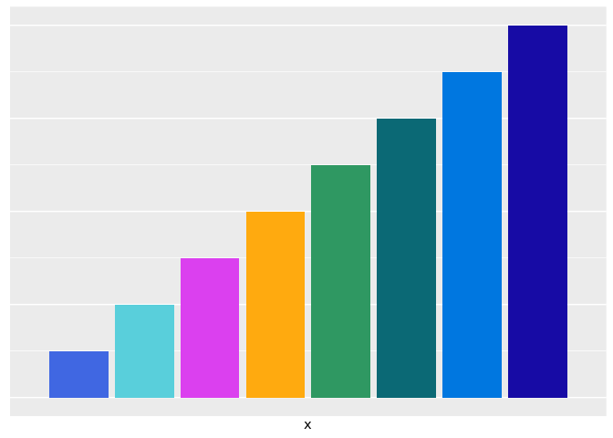
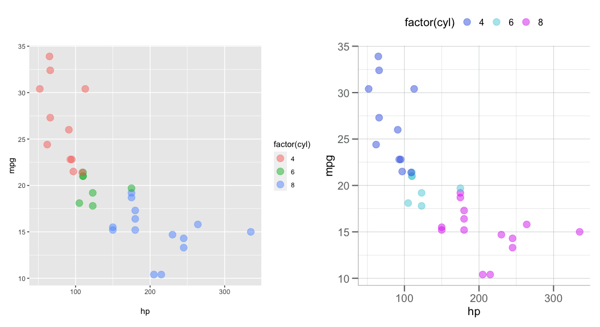

<!-- README.md is generated from README.Rmd. Please edit that file -->

# `SomaPlotr` <a href="https://somalogic.github.io/SomaPlotr"></a>

<!-- badges: start -->


[](https://cran.r-project.org/package=SomaPlotr)
[](https://cran.r-project.org/package=SomaPlotr)
[](https://github.com/SomaLogic/SomaPlotr/actions)
[](https://app.codecov.io/gh/SomaLogic/SomaPlotr?branch=main)
[](https://lifecycle.r-lib.org/articles/stages.html#experimental)
[](https://choosealicense.com/licenses/mit/)
<!-- badges: end -->

## Overview

The `SomaPlotr` R package contains various standardized plotting
functions designed to visualize SomaScan data in the R statistical
environment. `SomaPlotr` is based on the “Grammar of Graphics”
([Wilkinson,
2005](https://link.springer.com/book/10.1007/0-387-28695-0)), the same
layered framework of mapping variables to aesthetics that provides a
structure for [ggplot2](https://cran.r-project.org/package=ggplot2). As
such, `SomaPlotr` largely utilizes ggplot-style syntax, and can easily
and quickly create fully labeled, colored figures of SomaScan data.

`SomaPlotr` is designed to generate figures that are well-suited for the
exploration and visualization of SomaScan data. `SomaPlotr` is therefore
biased in towards cumulative distribution function (CDF) plots,
probability density function (PDF) plots, volcano and concordance plots,
grouped boxplots, and more.

Each panel in the figure below were generated with `SomaPlotr` and
pieced together into a grid with the
[patchwork](https://cran.r-project.org/package=patchwork) package. Read
on to learn how you can create these types of graphics using
`SomaPlotr`.



For a full table of the visualizations that can be created with
`SomaPlotr`, see the *Usage* section below.

------------------------------------------------------------------------

## Installation

`SomaPlotr` can be installed from
[GitHub](https://github.com/SomaLogic/SomaPlotr) using the `remotes`
package as follows:

``` r
remotes::install_github("SomaLogic/SomaPlotr")
```

## Usage

To load `SomaPlotr`, simply make a call to `library()`:

``` r
library(SomaPlotr)
```

`SomaPlotr` provides tools to create figures commonly used for the
visualization of SomaScan data. While the package does not include a
comprehensive list of all possible graphics, those that it *does*
contain are popular for exploring and analyzing patterns in SomaScan.

## Primary Functionality

The table below provides a high-level summary of the graphics that can
be created with `SomaPlotr`:

| Plot type    | Function(s)                                                  |
|:-------------|:-------------------------------------------------------------|
| CDF          | `plotCDF()`, `plotCDFlist()`, `plotCDFbyGroup()`             |
| PDF          | `plotPDF()`, `plotPDFlist()`, `plotCDFbyGroup()`             |
| Volcano      | `plotVolcano()`, `plotVolcanoHTML()`                         |
| Concordance  | `plotConcord()`                                              |
| Histogram    | `plotDoubleHist()`                                           |
| Boxplot      | `boxplotBeeswarm()`, `boxplotGrouped()`, `boxplotSubarray()` |
| Longitudinal | `plotLongitudinal()`                                         |

## Examples

The plotting functions in `SomaPlotr` require a SomaScan dataset as
input, and generate a complete, labeled figure that can be further
customized and modified, if desired.

Using `SomaPlotr`, the previously shown boxplot comparing RFU values
across groups can be generated via `boxplotGrouped()`:

``` r
# Simulate an example dataset
timepoint <- c("Treatment", "Relapse", "Remission")
withr::with_seed(101, {
  clin_df <- data.frame(
    TimePoint   = sample(timepoint, 80, replace = TRUE),
    seq.1234.56 = stats::rnorm(80, mean = 12, sd = 5)
  )
})

# Create grouped boxplot w/ customized title
boxplotGrouped(
  clin_df,
  y = "seq.1234.56", 
  group.var = "TimePoint", 
  beeswarm = TRUE, 
  main = "Box Plot of Sample Timepoint"
)
```



Similarly, we can replicate the CDF plot in the introductory figure
above via `plotCDF()`:

``` r
x <- withr::with_seed(101, rnorm(100, mean = 4))
cdf <- plotCDF(x)
cdf
```



A quantile/percentile line (the <span style="color:red">red line</span>
in the figure below) can be added to an existing CDF plot via
`addCDFquantiles()`:

``` r
cdf + addCDFquantiles(x, col = "red")
```



For a more in-depth overview of the package and a full list of example
plots, please see the package vignette:
`vignette("SomaPlotr", package = "SomaPlotr")`.

------------------------------------------------------------------------

## Color Palettes

`SomaPlotr` provides color palettes that correspond to SomaLogic
Operating Co., Inc. company color schemes:

``` r
scales::show_col(palette_soma(n = 8))
```



These palettes can be incorporated into figures in a variety of ways.
The `soma_colors` and `soma_colors2` objects provide individual hex
colors for the SomaLogic color scheme. These objects can be used to
transform the `ggplot` default color palette.

``` r
data.frame(x = seq_along(soma_colors2), y = seq_along(soma_colors2)) |> 
  ggplot(aes(x = x, y = y)) +
  geom_bar(stat = "identity", fill = soma_colors2) +
  scale_x_discrete(labels = names(soma_colors2)) +
  theme(axis.title.y = element_blank(),
        axis.text.y = element_blank(),
        axis.ticks.y = element_blank())
```



## Themes

The `theme_soma()` theme and `scale_color_soma()` functions provide a
uniform plotting and color scheme. By using the `theme_soma()` theme,
polished, publication ready figures can be generated with consistent
font sizes, backgrounds, legend positions, and more.

Below on the left, `p1` was created with the default
[ggplot2](https://cran.r-project.org/package=ggplot2) theme. On the
right, `p2` has the `theme_soma()` theme and `scale_color_soma()` color
scale applied.

``` r
p1 <- ggplot(mtcars, aes(x = hp, y = mpg, color = factor(cyl))) +
  geom_point(alpha = 0.5, size = 4)

p2 <- p1 + theme_soma(base_size = 15) + scale_color_soma()

p1 + p2
```



For a full list of available color scales and themes, see
`?SomaPlotr::theme_soma`.

------------------------------------------------------------------------

## MIT LICENSE

- See:
  - [LICENSE](https://github.com/SomaLogic/SomaPlotr/blob/main/LICENSE.md)
- The MIT license:
  - <https://choosealicense.com/licenses/mit/>
  - [https://www.tldrlegal.com/license/mit-license/](https://www.tldrlegal.com/license/mit-license)
- Further:
  - “SomaPlotr” and “SomaLogic” are trademarks owned by SomaLogic
    Operating Co., Inc. No license is hereby granted to these trademarks
    other than for purposes of identifying the origin or source of this
    Software.
